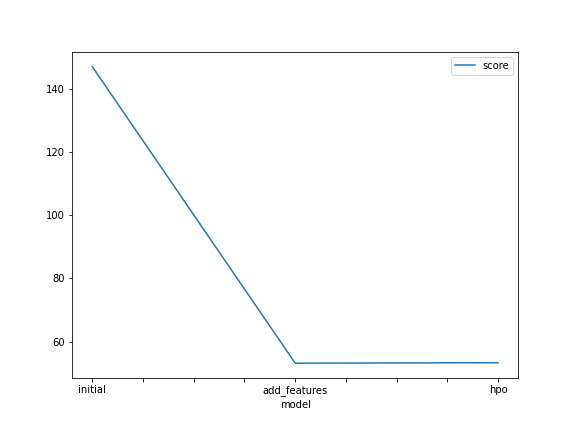
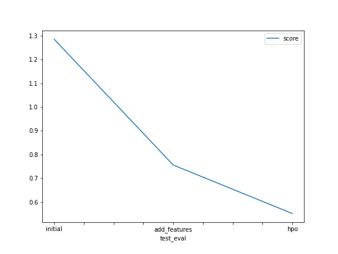

# Report: Predict Bike Sharing Demand with AutoGluon Solution
#### Maxim Shatskiy

## Initial Training
### What did you realize when you tried to submit your predictions? What changes were needed to the output of the predictor to submit your results?
Kaggle does not accept negative values in the submission.

### What was the top ranked model that performed?
Top ranked model performed not well with the final score of just 1.28544.

## Exploratory data analysis and feature creation
### What did the exploratory analysis find and how did you add additional features?
Target column has exponential distribution. Target column "count" is a sum of "registered" and "casual" and therefore has to be removed from the model. Additional features were added by spliting the date and taking a month, day, hour as separate features.

### How much better did your model preform after adding additional features and why do you think that is?
After additing additional features the score improve by almost 50% to 0.75600.
This is due to the fact that target column of number of rented bikes is highly dependent on the hour, day of the day and month of the year. Therefore these features explained seasonal variaitons
in the data.

## Hyper parameter tuning
### How much better did your model preform after trying different hyper parameters?
TODO: Add your explanation

### If you were given more time with this dataset, where do you think you would spend more time?
I would tried different feature engineering options and transformations of the target variable as well es hand made ensambles of the models. 

### A table with the models you ran, the hyperparameters modified, and the kaggle score.

|model|CAT depth|score|
|-----|-----|-----|
|initial|5|1.30748|
|initial|7|1.30195|
|initial|14|1.31381|
 
We increase depth parameter for CAT boosting model, which initially improveed the model. However futher increasing this parameter led to worse score. This is likely related to model overfitting the data.
Similar effect was observed for the model with added features.

### A line plot showing the top model score for the three training runs during the project.

### A line plot showing the top kaggle score for the three prediction submissions during the project.

## Summary
Adding relevant features significantly improves model. Hyperparameter tuning improves model by an additional small margin. 
AutoML with autotuning in AutoGluon is a fast methods to create model in a short time. From the plot it is clear that validation score provided 
by AutoGluon does not correlate well with the performce on the kaggle leadership board.

